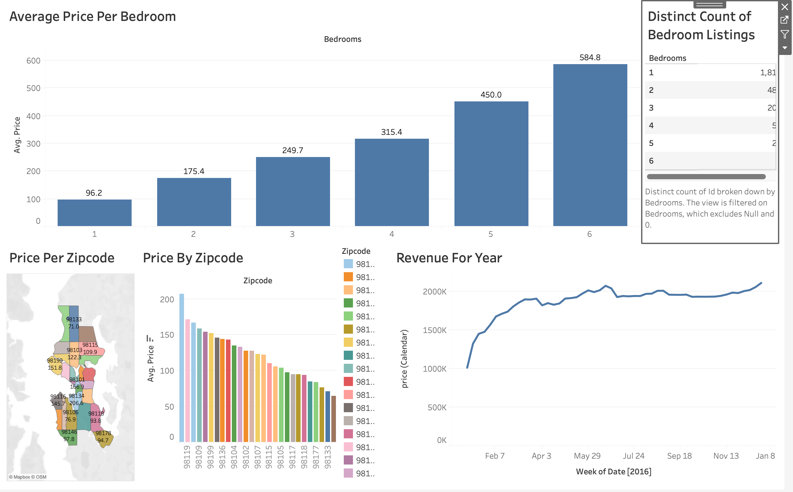

# Airbnb Data Analysis Dashboard

## Overview

This project showcases an interactive Tableau dashboard developed to analyze Airbnb listing data. The dashboard provides insights into pricing trends, bedroom distribution, revenue patterns, and geographic variations across different zip codes, enabling users to explore key business metrics through interactive visualizations.

## Dashboard Preview



## Objectives

- Analyze average Airbnb prices based on the number of bedrooms.
- Compare listing prices across different zip codes.
- Visualize geographic price distribution using an interactive map.
- Explore revenue trends over time.
- Summarize the distribution of Airbnb listings by bedroom count.

## Dashboard Features

The dashboard includes the following visualizations:

- **Average Price per Bedroom** – Compares average listing prices across different bedroom categories.
- **Price by Zip Code** – Displays the average Airbnb price for each zip code.
- **Geographic Price Distribution** – Maps listing prices across different locations.
- **Revenue Trend** – Shows changes in revenue over time.
- **Bedroom Listings Summary** – Displays the distribution of listings by bedroom count.

## Tools & Technologies

- Tableau

## Repository Structure

```text
Airbnb-Data-Analysis-Dashboard/
│
├── Airbnb-Data-Analysis-Dashboard.twbx
├── README.md
└── assets/
    └── dashboard.jpg
```

## How to View

1. Download the `Airbnb-Data-Analysis-Dashboard.twbx` file.
2. Open it using Tableau Desktop or Tableau Reader.
3. Interact with the dashboard to explore the visualizations and insights.

## Key Insights

- Average listing prices generally increase with the number of bedrooms.
- Airbnb prices vary significantly across different zip codes.
- Revenue exhibits noticeable trends throughout the year.
- Geographic visualization highlights regional pricing differences.
- The majority of listings are concentrated in lower-bedroom categories.

## Author

**Stuti Acharya**
