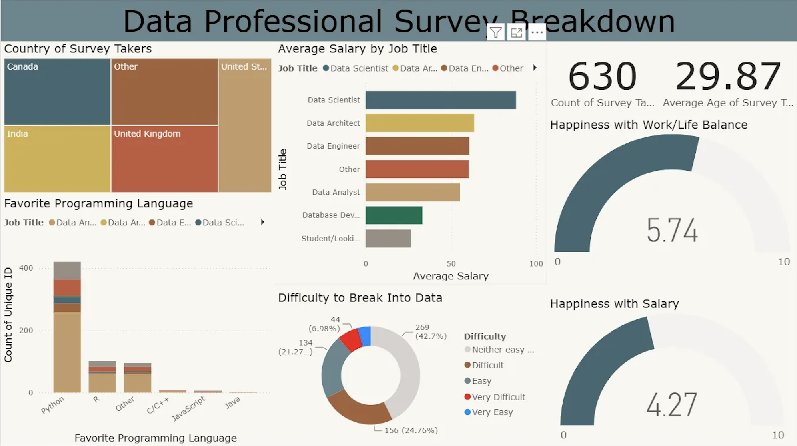

# Data Professional Survey Dashboard

An interactive Power BI dashboard built using survey responses from data professionals around the world. The dashboard provides insights into demographics, salaries, programming language preferences, work-life balance, and career satisfaction across various data-related roles.

## Dashboard Preview



## Project Overview

This dashboard explores responses from professionals working in different data careers, helping identify trends in:

- Salary across job roles
- Country-wise survey participation
- Favorite programming languages
- Average age of respondents
- Work-life balance satisfaction
- Salary satisfaction
- Difficulty of breaking into the data industry

The dashboard enables users to quickly understand the current landscape of data careers through interactive visualizations.

## Tools Used

- Power BI

## Key Insights

- Data Scientists reported the highest average salaries among surveyed roles.
- Python is the most popular programming language among respondents.
- Canada, India, the United Kingdom, and the United States contributed a large share of survey responses.
- Respondents generally reported moderate satisfaction with work-life balance.
- Many participants indicated that entering the data field is neither very easy nor very difficult.

## Repository Structure

```
Data-Professional-Survey-Dashboard/
│
├── Assets/
│   └── dashboard.png
│
├── Data Professional Survey Dashboard.pbix
├── README.md

```

## About

This project is part of my Data Analytics portfolio and demonstrates my ability to create interactive dashboards using Power BI, transform raw survey data into meaningful visualizations, and communicate insights effectively.
